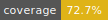

# dw — discussion workspace picker



**Spin up a dated workspace for every topic you explore with Claude — then fuzzy-jump back to any of them.**

`dw` gives each topic its own `<category>/<YYYY-MM-DD>-<topic>/` folder with a
frontmatter README. No naming ceremony: type a topic, pick a category, and start
working. Later, fuzzy-find it and `cd` straight in.

```text
$ dw
> k8s pod                                         research/2026-06-14-k8s-pod-oom
  db outage                                       incident/2026-06-01-db-outage
  + create: 2026-06-17-k8s-pod                    (pick a category)
    status: active  tags: [gpu, linux]  created: 2026-06-14
```

## Features

- **Dated auto-layout** — workspaces live at `<root>/<category>/<YYYY-MM-DD>-<topic-slug>/`, created for you.
- **Create on demand, no `create` command** — type a topic; if nothing matches, pick a category and `dw` makes it. Categories are created on the fly too.
- **Category chosen after the topic** — write what you're thinking about first, file it second.
- **Fuzzy jump** — fuzzy-match across `category/name` and titles, newest first, fzf-style.
- **Resume instantly** — your last workspace is pinned to the top; `dw -` jumps to it with no UI.
- **Frontmatter-aware** — shows `status` / `tags` / `created` from each README under the selection.
- **Scriptable** — `dw list` is a clean, pipeable stream (`dw list --json` for machine consumption).
- **Unicode-safe slugs** — Japanese and other scripts survive slugification (`機械学習 調査` → `機械学習-調査`).
- **Zero-config** — defaults to `~/dw`; one env var to relocate.

## Install

```sh
go install github.com/edge2992/dw@latest
```

## Shell integration

`dw` is a child process, so it cannot change your shell's working directory itself.
Instead it prints the chosen path to **stdout**, and a thin wrapper function does the
`cd`. Add this to your `~/.zshrc` (or `~/.bashrc`):

```zsh
function dw() {
  local dir
  dir=$(command dw "$@") && [ -n "$dir" ] && cd "$dir"
}
```

Want to land in the workspace and launch Claude in one go? Add a second wrapper:

```zsh
function dwc() {
  local dir
  dir=$(command dw "$@") && [ -n "$dir" ] && cd "$dir" && claude
}
```

## Quickstart

```sh
dw                 # open the picker: fuzzy-find, or type a new topic to create one
dw -               # jump straight back to your last workspace
dw list            # print every workspace as category/name
dw root            # print the workspace root
```

In the picker:

- Type to filter, `enter` to `cd` into the highlighted workspace.
- No match? A `+ create: <date>-<slug>` row appears → `enter` → **pick a category** → it's created and you `cd` in.
- At the category step, type an unknown name to spin up a **new category**; `esc` goes **back** to browse so you can retype the topic.
- `↑/↓` (or `ctrl+p` / `ctrl+n`) to move; `esc` / `ctrl+c` to abort.

## Commands

| Command | Description |
|---|---|
| `dw` | Open the interactive picker (fuzzy list + create-on-demand). |
| `dw -` | Jump to the last workspace; prints its path. |
| `dw list` | List workspaces as `category/name`, one per line. |
| `dw list --json` | List workspaces as a JSON array (includes absolute `path`). |
| `dw root` | Print the resolved workspace root. |
| `dw version` | Print the version. |
| `dw help` / `-h` | Show usage. |

Every path-producing command writes to **stdout**; diagnostics go to stderr. That's
what makes the `dw()` wrapper and pipelines like `dw list | fzf` work.

## Layout

```text
$DW_ROOT/<category>/<YYYY-MM-DD>-<topic-slug>/
  README.md   # frontmatter-indexed entry point
```

`$DW_ROOT` defaults to `~/dw`. Categories are arbitrary folders; the defaults
offered when empty are `research`, `incident`, `discussion`, `scratch`.

## Configuration

- **`DW_ROOT`** — workspace root. Defaults to `~/dw`.
- **Template** — if `~/.config/discussion/template.md` exists it is used for new
  READMEs, otherwise a built-in default is used. Placeholders: `{{title}}`,
  `{{category}}`, `{{date}}`.
- **Last-workspace cache** — recorded under `os.UserCacheDir()` (`~/Library/Caches/dw/last`
  on macOS, `~/.cache/dw/last` on Linux). Drives both the top-of-list pin and `dw -`.

## Migration

> **Breaking change.** The default root moved from `~/Discussion` to `~/dw`, and the
> environment variable was renamed `DISCUSSION_ROOT` → `DW_ROOT`. The old variable is
> no longer read.

If you have an existing `~/Discussion` tree, either point `dw` at it or move it:

```sh
export DW_ROOT=~/Discussion   # keep your data where it is
# — or —
mv ~/Discussion ~/dw          # adopt the new default
```

## Architecture

- `internal/workspace` — scanning / slugification / creation / templates / last-path persistence (pure logic, tested).
- `internal/tui` — the single bubbletea fuzzy list (jump + create + category select + pin).
- `main.go` — subcommand dispatch (`run()`); wires `dw -`, `list`, `root`, `version`, `help`, and the picker.

## Development

```sh
make fmt    # gofumpt + goimports (golangci-lint fmt)
make lint   # golangci-lint run
make test   # go test -race ./...
make        # all of the above
```

- **Lint/Format**: golangci-lint v2 (config `.golangci.yml`, standard set + misspell/revive; formatters gofumpt/goimports).
- **Hooks**: pre-commit framework (`.pre-commit-config.yaml`). A global pre-commit hook delegates here after gitleaks, so `pre-commit install` is not required. Setup: `uv tool install pre-commit`, `brew install golangci-lint`.
- **CI**: GitHub Actions (`.github/workflows/ci.yml`) runs build / test -race / golangci-lint.

## License

[MIT](LICENSE) © edge2992
